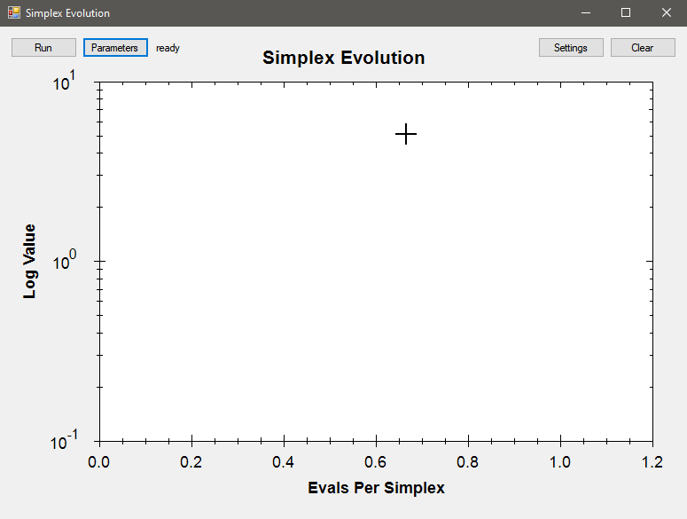
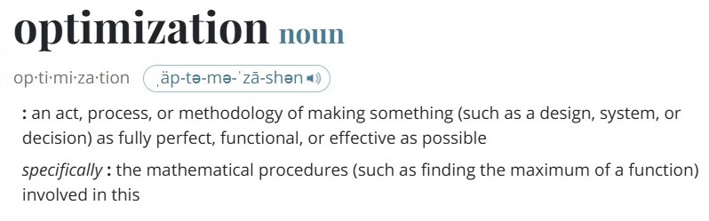
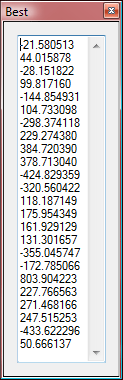
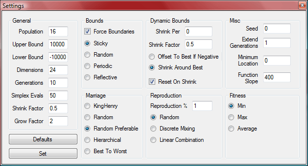

# Simplex-Evolution
The demo is a front end to an optimizer used on a large multivariate model for financial trades many years ago. This was a time before we had cheap powerful computers and called ourselves data scientists. In those young naive years, we had to take some liberties and be a bit creative in how we approached the problem mathematically and programmed it.

  * [Optimization in Real Life](#Optimization-in-Real-Life)
  * [Evolution into Amoebas](#Evolution-into-Amoebas)
  * [Improving Performance Through Threads](#Improving-Performance-Through-Threads)
  * [Overview of Application](#Overview-of-Application)

# Optimization in Real Life
So what exactly is [optimization](https://en.wikipedia.org/wiki/Mathematical_optimization)? [Merriam Webster](https://www.merriam-webster.com/) defines it as: 

I believe most of us are familiar with and use the first definition, however in this context we dwell more on the second, *the method of finding a minimum or maximum value*. For those well versed in mathematics, we would instantly open our calculus toolbox and go to work, however let's go about this in a different and more intuitive manner.

Let's take an example from real-world and suppose we are outside in rugged terrain, how would we know if we are at the highest point within a certain area? Naturally we could simple look around and see if there are higher points than where we are. It may not be apparently obvious, but this is a bit like cheating for a computer as they cannot *see* the landscape. Well if we were blindfolded, what we could do is take small test steps in certain directions and if any of them feel higher, move in that direction that feels highest. After repeating this until all the directions we test feel lower, we must be on a high spot. We cannot say it is *the* highest however. It could be that we are on a mole hill in a large valley. Our method was valid, unfortunately it only found one of likely many **local** maximums, and ultimately we wish to find the maximum of all of them, the **global**.

So how to fix this? Let's recruit friends and randomly place them in the area. After they moved around blindfolded, each finding a local maximum. We could simply repeatedly  do this, recording their positions and altitudes each time, however instead of randomly arranging them each time, let's have them communicate with each other to decide where to start next time. This may seem trivial as all they would be exchanging with each other are their 2D coordinates, geographically speaking, there may be nothing special with a particular longitudinal line (it would be odd if a mountain range lined up exactly on one). Unfortunately, all problems are not this easy and have a real-world analogy. This demo is looking for a unique minimum from hundreds of slightly larger valleys. Not only in 2 dimensions but 24. The particular function used is the [Griewank function](https://en.wikipedia.org/wiki/Griewank_function) seen here:

# Evolution into Amoebas
So that's the basics of what we are doing is the simplest terms. Of course the [hill climbing method](https://en.wikipedia.org/wiki/Hill_climbing) described is all well and good for straightforward problems but is has several shortcommings. A more complex algorithm better suited is the [Nelder-Mead Simplex Method](https://en.wikipedia.org/wiki/Nelder%E2%80%93Mead_method). The common analogy of this is an amoeba composed of 3 points (in our 2D example) which can ooze and contract as needed. An important perk of this method is that it does not require the use of derivatives which either need to be known or estimated (requiring additional steps).

This improves one aspect of our process, however we never described exactly how the coordinates are used after each trial, especially if it a list of 24 values. This can done via a [Genetic Algorithm](http://en.wikipedia.org/wiki/Genetic_Algorithm) which mimics how organisms evolve. Think of those values as their DNA. Once each simplex finds a good spot, they are ranked, married, and create a new generation. Their offspring move about and repeat. 

You may wonder, why even bother with letting them move about since genetic algorithms, just in real life, mutate. This can be perceived as a little bit of random nudging. Those that were nudged in the right direction would overtime outlast those that went in the wrong direction. Indeed this does work, however allowing each generation to feel out their territory before breeding them makes the process more deterministic and easier to analyze. How long we allow them to move vs how much mutation is in the art of the tuning this algorithm. We even have choice in how we pair them up and reproduce.

# Improving Performance Through Threads
Up to now we have been discussing how to mathematically optimize our algorithm however another way is through how the computer actually executes it. At the time, multi-core processors were reserved for servers for which this application luckily would be run on. If programmed, we could execute parts of the algorithm simultaneously, at the cost of complexity (and headaches).  Typically this is not worth doing however in the original use of this application a single evaluation (i.e. finding the height we are at) could take up to 10 minutes. This would equate to only 288 amoeba-steps over the course of 48 hours. 

Programming each amoebas run independently on their own thread we could easily scale the application with the number of cores we have access to. Thus the original 16-core processor allowed 32 amoebas to run in parallel. If we allowed each to take only 9 steps, this would take only 90 minutes compared with the 288 steps they would've needed without the parallelization. The cost of this is the overhead managing **events** allowing them to communicate back their results when complete and where to restart their search.

# Code Overview
A few quick notes on the source code. Its programmed in  C# .net 2.0 and used [ZedGraph](https://github.com/ZedGraph/ZedGraph) for graphing. The actual algorithm is self contained (in that it need only request parameter be evaluated ) and thread safe. Internally it is driven by a message queue which communicates between it's classes.

The algorithm makes use of 3 classes that are hierarchically connected. The first being a [single simplex](Source/Simplex.cs) which handles the specific actions of an amoeba (flopping around, stretching, contracting, and so on). Apart from being event driven, it is basically a standalone [Nelder-Mead Simplex Algorithm](https://en.wikipedia.org/wiki/Nelder%E2%80%93Mead_method).

The next is the [work colony](Source/SimplexWorkColony.cs) which is a **collection** of simplexes doing their thing. Apart from being a simple container, it handles the evaluation queue which is a collection of parameter sets that need to be evaluated and then sent back to their respective workers. This class can be thought of as the foreman that needs to convey info between the workers and president. The queue's purpose is to keep the foreman from talking to the president about every little thing.

The last is the  [genetics](Source/SimplexGenetics.cs)  which supersedes the colony. It owns the colony and every so often stops it and forces them to evolve. At the heart of this class is simply a down and dirty  [Genetic Algorithm](http://en.wikipedia.org/wiki/Genetic_Algorithm). Its not standalone like the simplex  class  because it is specifically tailored to handle and own a colony. The reason for this is that it actually reuses the colony. It may seem weird biologically but the worker's children are the workers themselves.

Apart from each of these  classes  having a hierarchy of  message queues  each has its own diagnostic log. The [simple logger](Source/SimpleLogger.cs) class keeps particular info based on priority of each object and allows them to be merged and saved.

The last three  classes ([main](Source/Main.cs),  [settings](Source/Settings.cs), and  [best](Source/Best.cs)) are for their respective windows. The  [main](Source/Main.cs)  class  may be of interest since it contains the actual implementation of the algorithm and use of [ZedGraph](https://github.com/ZedGraph/ZedGraph). Additionally it handles the various window events. The  [settings](Source/Settings.cs) class  contains a plethora of boring  controls  however also contain the hidden gem of simple error checking. The [best](Source/Best.cs) yields the final results.

A Windows binary is available for [download](Release/Simplex_Evolution_Demo.zip "Zip file of demo"). It was built in 2008 however has been tested up to Windows 10 Home (22H2).

# Overview of Application

The main window will show the log error of each simplex over their evolution (each with a unique color). The demo is attempting to identify the minimum of the [Griewank function](https://en.wikipedia.org/wiki/Griewank_function) in 24 dimensions. Pressing `Run` will initially produce 10 generations each with 50 simplex steps. Subsequent clicking `Run` will generate a new generation, converging to the global minimum of exactly 0. 

Pressing `Best` will open the values of the current optimal.

The actual location of the minimum, dimensions, and various algorithm parameters to tune are available via `Settings`.

> ### :memo: TODO
> Add further explanation of parameters.

Finally the `Clear` button will reset the display, however *not* the algorithm. Unfortunately the cleanest way to start over is to reopen the application.

